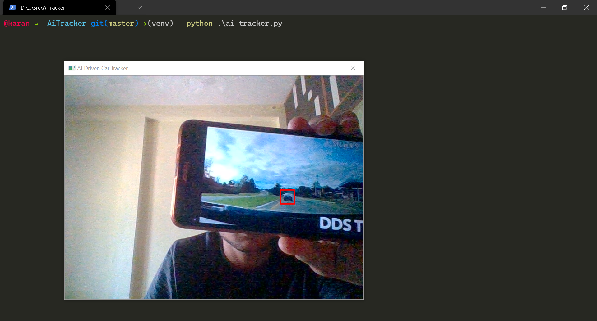

# Ai Tracker

The program is used to track cars and pedestrians in a given video or using your webcam.
currently the program's source is webcam but can be changed to the location of a file you want to test.

# Installation

`pip install opencv-python`

Download the repository and install the above package.

# Running

`python ai_tracker.py`

This will open the window straming the source with bounding boxes on the identified objects.

**To Close the window and quit the program press `Q Key`.**

# Screenshot

